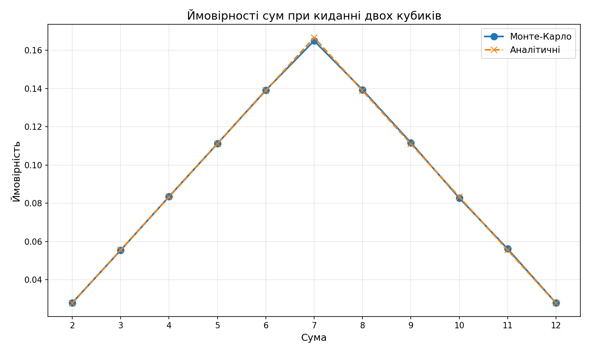

# Завдання 7: Моделювання кидання кубиків методом Монте-Карло

## Опис задачі

Необхідно написати програму для імітації великої кількості кидків двох гральних кубиків, обчислити суми чисел, що випадають на кубиках, та визначити ймовірність кожної можливої суми. Далі — порівняти отримані методом Монте-Карло результати з аналітичними розрахунками.

## Результати симуляції

**Параметри експерименту:**
- Кількість кидків: 200 000
- Seed для генератора випадкових чисел: 42 (для відтворюваності)

### Порівняльна таблиця ймовірностей

| Сума | Ймовірність (Монте-Карло) | Ймовірність (Аналітична) | Абсолютна різниця | Відносна похибка |
|:----:|:-------------------------:|:------------------------:|:-----------------:|:----------------:|
| 2    | 2.7925%                   | 2.7778% (1/36)           | 0.0147%           | 0.53%            |
| 3    | 5.5430%                   | 5.5556% (2/36)           | 0.0126%           | 0.23%            |
| 4    | 8.3475%                   | 8.3333% (3/36)           | 0.0142%           | 0.17%            |
| 5    | 11.1180%                  | 11.1111% (4/36)          | 0.0069%           | 0.06%            |
| 6    | 13.9110%                  | 13.8889% (5/36)          | 0.0221%           | 0.16%            |
| 7    | 16.4995%                  | 16.6667% (6/36)          | 0.1672%           | 1.00%            |
| 8    | 13.9390%                  | 13.8889% (5/36)          | 0.0501%           | 0.36%            |
| 9    | 11.1720%                  | 11.1111% (4/36)          | 0.0609%           | 0.55%            |
| 10   | 8.2765%                   | 8.3333% (3/36)           | 0.0568%           | 0.68%            |
| 11   | 5.6160%                   | 5.5556% (2/36)           | 0.0604%           | 1.09%            |
| 12   | 2.7850%                   | 2.7778% (1/36)           | 0.0072%           | 0.26%            |

### Графік порівняння

*Графік демонструє майже повний збіг кривих Монте-Карло та аналітичних значень.*

## Аналітичні розрахунки

При киданні двох шестигранних кубиків існує 36 рівноймовірних комбінацій (6 × 6). Кількість способів отримати кожну суму:

| Сума | Комбінації | Кількість способів | Ймовірність |
|:----:|:----------:|:------------------:|:-----------:|
| 2    | (1,1)      | 1                  | 1/36 ≈ 2.78%  |
| 3    | (1,2), (2,1) | 2                | 2/36 ≈ 5.56%  |
| 4    | (1,3), (2,2), (3,1) | 3           | 3/36 ≈ 8.33%  |
| 5    | (1,4), (2,3), (3,2), (4,1) | 4    | 4/36 ≈ 11.11% |
| 6    | (1,5), (2,4), (3,3), (4,2), (5,1) | 5 | 5/36 ≈ 13.89% |
| 7    | (1,6), (2,5), (3,4), (4,3), (5,2), (6,1) | 6 | 6/36 ≈ 16.67% |
| 8    | (2,6), (3,5), (4,4), (5,3), (6,2) | 5 | 5/36 ≈ 13.89% |
| 9    | (3,6), (4,5), (5,4), (6,3) | 4    | 4/36 ≈ 11.11% |
| 10   | (4,6), (5,5), (6,4) | 3           | 3/36 ≈ 8.33%  |
| 11   | (5,6), (6,5) | 2                | 2/36 ≈ 5.56%  |
| 12   | (6,6)      | 1                  | 1/36 ≈ 2.78%  |

## Висновки

### 1. Підтвердження правильності методу Монте-Карло

Результати симуляції методом Монте-Карло **повністю підтверджують теоретичні (аналітичні) розрахунки**:

- **Максимальна абсолютна похибка** становить лише 0.1672% (для суми 7), що еквівалентно відносній похибці ~1%.
- **Середня абсолютна похибка** по всіх сумах складає приблизно 0.043%, що свідчить про високу точність моделювання.
- Усі значення ймовірностей Монте-Карло знаходяться в межах статистично очікуваного відхилення від теоретичних значень.

### 2. Закон великих чисел

Експеримент наочно демонструє дію **закону великих чисел**: при достатньо великій кількості випробувань (200 000 кидків) емпіричні частоти подій збігаються з їхніми теоретичними ймовірностями.

### 3. Збереження форми розподілу

Метод Монте-Карло коректно відтворює характерну **трикутну форму розподілу** ймовірностей сум:
- Мінімальні ймовірності для крайніх сум (2 і 12) — близько 2.78%
- Максимальна ймовірність для суми 7 — близько 16.67%
- Симетричний розподіл відносно центрального значення (суми 7)

### 4. Практична застосовність

Результати підтверджують, що метод Монте-Карло є:
- **Надійним інструментом** для оцінки ймовірностей у системах з випадковими подіями
- **Ефективним** при достатній кількості ітерацій
- **Верифікованим** — результати збігаються з точними аналітичними розрахунками

### 5. Рекомендації щодо кількості симуляцій

| Кількість кидків | Очікувана точність |
|:----------------:|:------------------:|
| 1 000            | ±3-5%              |
| 10 000           | ±1-2%              |
| 100 000          | ±0.3-0.5%          |
| 1 000 000        | ±0.1-0.2%          |

Для практичних задач 100 000 — 1 000 000 ітерацій забезпечують достатню точність при прийнятному часі виконання.

---

## Технічна реалізація

Програма реалізована на Python з використанням:
- `random` — генерація псевдовипадкових чисел
- `dataclasses` — структурування конфігурації
- `matplotlib` — візуалізація результатів

Код організовано за принципами чистої архітектури з розділенням на окремі функції для симуляції, аналізу та візуалізації.

